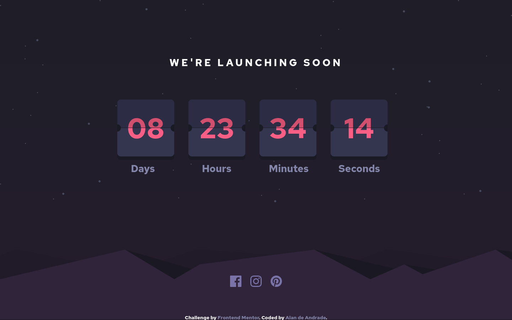

# Frontend Mentor - Launch countdown timer solution

This is a solution to the [Launch countdown timer challenge on Frontend Mentor](https://www.frontendmentor.io/challenges/launch-countdown-timer-N0XkGfyz-). Frontend Mentor challenges help you improve your coding skills by building realistic projects. 

## Table of contents

- [Overview](#overview)
  - [The challenge](#the-challenge)
  - [Screenshot](#screenshot)
  - [Links](#links)
- [My process](#my-process)
  - [Built with](#built-with)
  - [What I learned](#what-i-learned)
  - [Continued development](#continued-development)
  - [Useful resources](#useful-resources)
- [Author](#author)
- [Acknowledgments](#acknowledgments)

## Overview

### The challenge

Users should be able to:

- See hover states for all interactive elements on the page
- See a live countdown timer that ticks down every second (start the count at 14 days)
- **Bonus**: When a number changes, make the card flip from the middle

### Screenshot

### Links

- Solution URL: [Add solution URL here](https://github.com/Alan-A-Andrade/Launch-countdown-timer-challenge)
- Live Site URL: [Add live site URL here](https://launch-countdown-timer-challenge-my1yfqo2c-alan-a-andrade.vercel.app/)

## My process

### Built with

- React.js
- Styled Components
- [React](https://reactjs.org/) - JS library
- [Styled Components](https://styled-components.com/) - For styles

### What I learned

I pretty much bitted more than I could chow here, but im proud of the final product, I can see where the code need improvements, but is deployed and function under my time constriction.

### Continued development

I still need time to learn more about react and programming in general, I need to improve my logic.

### Useful resources

- [Change color of SVG](https://codepen.io/sosuke/pen/Pjoqqp) - This helped me a lot in controlling the SVG icon colors.

## Author

- Website - [Add your name here](https://github.com/Alan-A-Andrade)
- Frontend Mentor - [@yourusername](https://www.frontendmentor.io/profile/Alan-A-Andrade)

## Acknowledgments

As always, i would like to say thanks you to my mom, that always help and incentivize my learning.

